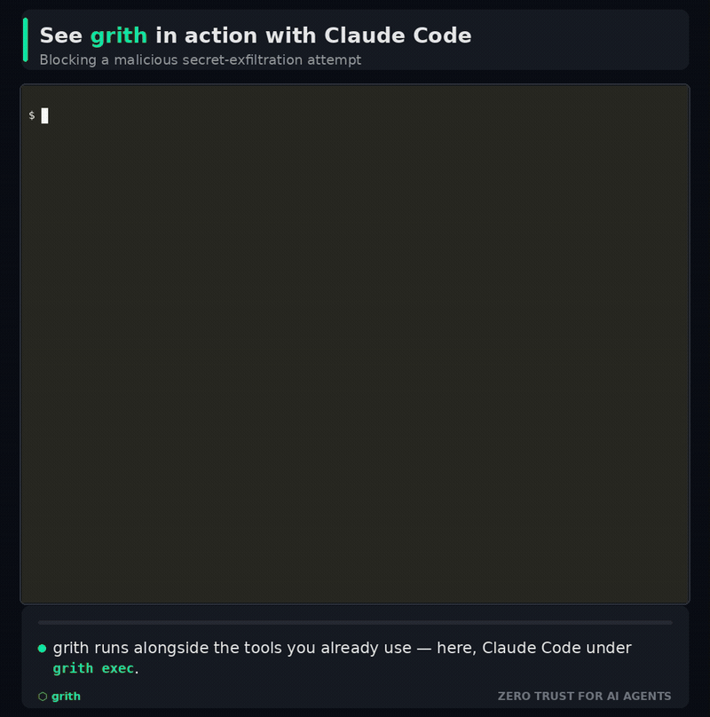

<p align="center"><strong>grith</strong> is an OS-level security supervisor for AI coding agents. It intercepts every syscall your agent makes and decides what actually runs.</p>

<p align="center">
  <a href="https://grith.ai"></a>
</p>

<p align="center">
  Claude Code ships the feature, then tries to POST <code>.env</code> to an outside host. grith denies it at the kernel boundary.<br />
  <a href="https://grith.ai">grith.ai</a> &nbsp;·&nbsp; <a href="https://docs.grith.ai">Documentation</a> &nbsp;·&nbsp; <a href="https://grith.ai/security">Security model</a>
</p>

---

## Quickstart

Install on Linux (x86_64 or arm64):

```bash
curl -fsSL https://grith.ai/install | sh
```

Wrap the agent you already use:

```bash
grith exec -- claude-code "fix the failing test"
```

Or run grith's own agent, with the same filters in front of every tool call:

```bash
grith run "list every TODO in this repo"
```

Every file read, shell command, network call, and process spawn is scored before the kernel executes it:

| Score | Verdict | What happens |
| --- | --- | --- |
| under 3.0 | **allow** | the call proceeds |
| 3.0 to 8.0 | **queue** | the process freezes until you approve or deny it |
| over 8.0 | **deny** | the call never runs |

Nothing runs on a maybe. Eleven built-in profiles (claude-code, codex, aider, cursor, cline, copilot, goose and others) auto-allow each tool's routine work, so the queue only sees the calls worth your attention.

<details>
<summary>Supported platforms, other install methods, and building from source</summary>

| Platform | Architecture | Status |
| --- | --- | --- |
| Linux | x86_64 | supported (kernel 4.8+) |
| Linux | aarch64 | supported (kernel 5.3+) |
| macOS | Apple Silicon / Intel | v2.0 - needs an Endpoint Security backend |
| Windows | x86_64 | v2.0 - needs an ETW backend |

The installer auto-detects your platform, verifies the SHA-256 checksum, and installs to `~/.local/bin`. Pass `--global` to install to `/usr/local/bin`, or `--version <version>` to pin a release:

```bash
curl -fsSL https://grith.ai/install | sh -s -- --global
```

You can also download a binary directly from the [latest release](https://github.com/grith-ai/grith/releases/latest), or build from source with Rust 1.88+ and Node 22+:

```bash
git clone https://github.com/grith-ai/grith.git && cd grith && make dist
```

Full build instructions are in the [documentation](https://docs.grith.ai).

</details>

## Verifying a release

Every release ships a static musl binary with a SHA-256 checksum, a cosign keyless signature, a CycloneDX SBOM (itself signed), and SLSA build provenance. If `cosign` is on your PATH, the installer verifies the signature against the release workflow's identity automatically - no flags needed. To verify by hand, see [release verification](https://docs.grith.ai).

## What leaves your machine

By default, nothing. The free tier runs entirely offline: no account, no telemetry, and the audit log stays in local SQLite. Paid tiers validate their licence against grith.ai roughly once a day, and sync aggregated analytics - counts, verdicts, risk and filter attribution, never commands, file paths, prompts or payloads - until you turn that off with `general.audit_sync = false` (licence validation continues; air-gapped deployments disable it too). The raw audit log never leaves your machine.

Supervision-escape enforcement is **on by default** as of v0.2.5: spawning something that hands work to an unsupervised peer (`systemd-run`, `docker`, `tmux`) reaches the review queue rather than running unseen. Non-interactive sessions have no one to ask, so they fail safe and deny - if a CI script legitimately delegates, permit the binary in its profile or set `supervisor.enforce_authority_delegating_spawn = false`.

## Documentation

- [Getting started](https://docs.grith.ai) - installation, configuration, and the CLI reference
- [Security model](https://grith.ai/security) - the filter pipeline, scoring, and what it does not cover
- [Supervisor profiles](https://docs.grith.ai/docs/concepts/supervisor-profiles) - per-tool allowlists and how to write your own
- [CHANGELOG](CHANGELOG.md) - including the bypass classes we have not closed yet

## Contributing

Pull requests are welcome - start with [CONTRIBUTING.md](CONTRIBUTING.md), which covers the [CLA](CLA.md) and the local setup. grith is developed in a private monorepo and exported here per release, so this repository's history is one commit per export rather than per change; PRs are reviewed on GitHub and applied upstream with attribution.

Found a security issue? Please follow [SECURITY.md](SECURITY.md) rather than opening a public issue.

## Licence

Repository code: [MPL-2.0](LICENSE)

Pro and Enterprise capabilities ship in the same binary and are unlocked by signed licenses. Hosted billing, license issuance, and cloud sync infrastructure are not part of this repository.
